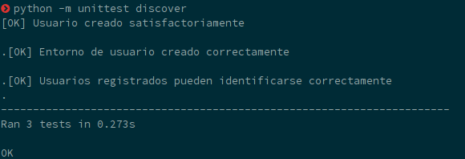
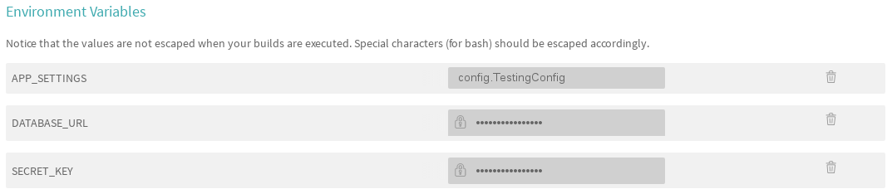
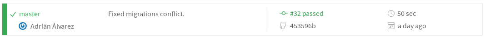
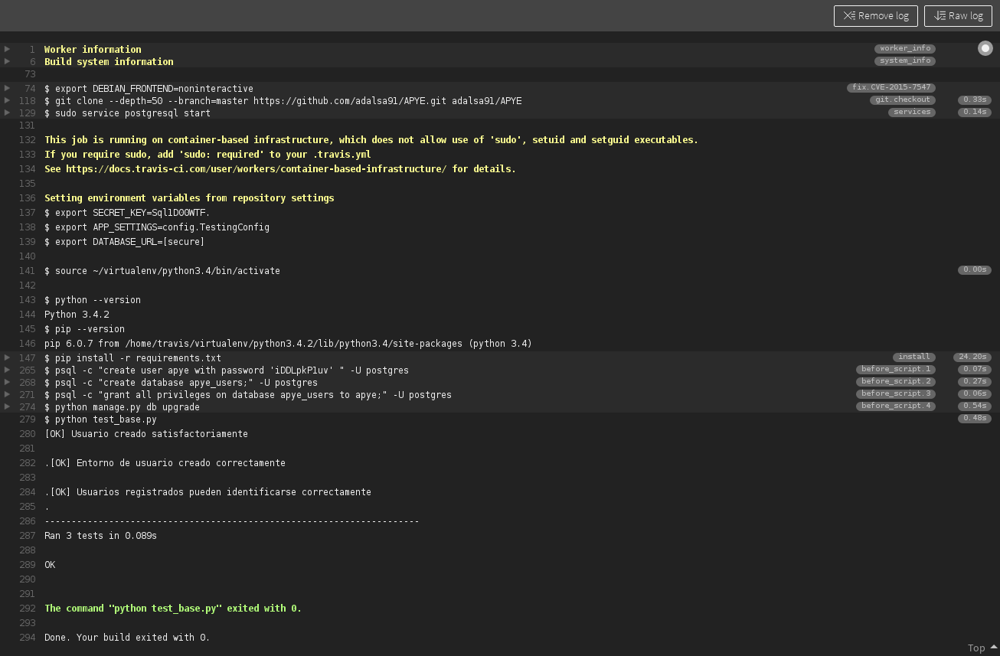

#Hito 2: Integración continua
##Requisitos
Para la descripción de las dependencias de la aplciación se ha creado un archivo *requeriments.txt* que suele ser el nombre usado por convención en Python.
```
click==6.6
Flask==0.11.1
gunicorn==19.6.0
itsdangerous==0.24
Jinja2==2.8
MarkupSafe==0.23
Werkzeug==0.11.11
psycopg2==2.6.2
SQLAlchemy==1.1.2
Flask-SQLAlchemy==2.1
Flask-Migrate==2.0.0
Flask-Testing==0.6.1
Flask-Login==0.4.0
Flask-WTF==0.13.1
WTForms==2.1

```
##Tests
Para asegurar el correcto funcionamiento de la aplicación antes de ser desplegada se han escrito los siguientes tests. Para la automatización de los test se ha usado el framework de test **unittest** de Python, que además de orquestar la ejecución de los test proporciona una clase base llamada *TestCase* que podemos usar para crear nuevos casos de prueba, esta clase incluye métodos como **setUp* o *tearDown* que permiten configurar un entorno funcional para la realización de los test y limpiarlo todo tras las pruebas.

```python
import unittest
import os
import shutil
from app import app, db
from models import User
from flask_login import current_user


class ApyeTestCase(unittest.TestCase):
    """A base test case for flask-tracking."""

    def create_app(self):
        app.config.from_object('config.TestConfiguration')
        return app

    def setUp(self):
        db.session.close()
        db.drop_all()
        db.create_all()
        self.app = app.test_client()
        if not os.path.exists('users/'):
            os.makedirs('users/')

    def tearDown(self):
        db.session.remove()
        db.drop_all()
        shutil.rmtree('users')

    def test_adduser(self):
        usuario = User('adrian', 'adalsa@correo.ugr.es',
                       'password', 'Adrian', True)
        db.session.add(usuario)
        db.session.commit()
        usuarios = User.query.all()
        assert usuario in usuarios
        print("[OK] Usuario creado satisfactoriamente\n")

    def test_home_user(self):
        if not os.path.exists('users/' + 'adrian'):
            os.makedirs('users/' + 'adrian')
        f = open('users/adrian/Welcome', 'w+')
        f.write('Welcome!')
        f.seek(0)
        assert f.read() == 'Welcome!'
        f.close()
        print("[OK] Entorno de usuario creado correctamente\n")

    def test_login_logout(self):
        usuario = User('jorge', 'jorge@correo.ugr.es',
                       'password', 'Jorge Nitales', True)
        db.session.add(usuario)
        db.session.commit()

        with self.app:
            # Login
            response = self.app.post(
                '/login', data={'username': 'jorge', 'password': 'password'},
                follow_redirects=True)
            assert current_user.username == 'jorge'
            assert b'Success' in response.data

            # Logout
            response = self.app.post(
                '/logout', follow_redirects=True)
            assert current_user.is_anonymous

        print("[OK] Usuarios registrados pueden identificarse correctamente")

if __name__ == '__main__':
    unittest.main()

```

Para ejecutar los tests utilizamos la función **discover** de *unittest*:

```bash
	python -m unittest discover

```

Este comando busca recursivamente tests desde el directorio en el que lo lanzamos.



Para simplificar el lanzamiento de tests y otras tareas creamos un **Makefile**:

```make
install:
	pip install -r requirements.txt

test:
	python -m unittest discover

run:	
	python manage.py runserver
	
```

##Integración Continua

Para este paso usamos el sistema de integración continua **Travis**, el mótivo de la elección es debido a su popularidad y documentación.

El primer paso es sincronizar *Travis* con nuestro *GitHub*, para ello iniciamos sesión en *Travis* con nuestra cuenta de *GitHub* y activamos el repositorio que queremos conectar en la página de nuestro perfil de *Travis*.


A continuación creamos el archivo `.travis.yml` en el que especificaremosel lenguaje y versión usados, además de otros datos necesarios para construir el entorno de ejecución y el comando para ejecutar los tests.

```make
language: python
python:
  - "3.4"

install: "pip install -r requirements.txt"

services:
  postgresql

before_script:
  - psql -c "create user apye with password 'iDDLpkP1uv' " -U postgres
  - psql -c "create database apye_users;" -U postgres
  - psql -c "grant all privileges on database apye_users to apye;" -U postgres
  - python manage.py db upgrade

script: python test_base.py


```

También necesitaremos definir las variables de entorno necsarias para la aplicación, podemos hacerlo en el fichero anterior o en la interfaz web.



Una vez todo esté configurado hacemos un add --> commit --> push y Travis detectará los cambios en nuestro repositorio de GitHub y lanzará los tests. Podemos comprobar el resultado en la página web de *Travis*.




Además Travis nos ofrece un incrustable que demuestra el estado actual del repositorio.

[](https://travis-ci.org/adalsa91/APYE)