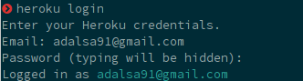
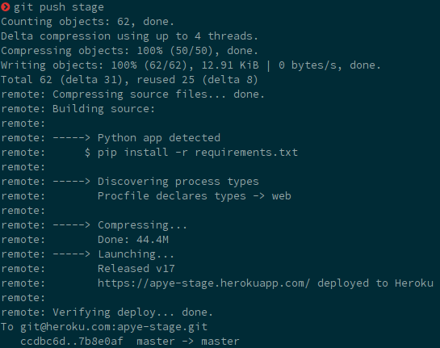
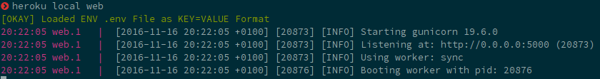
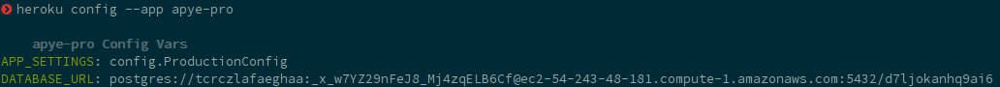
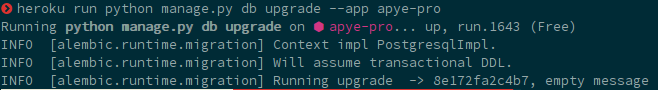
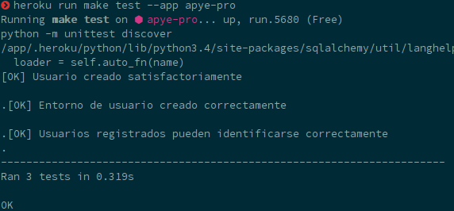
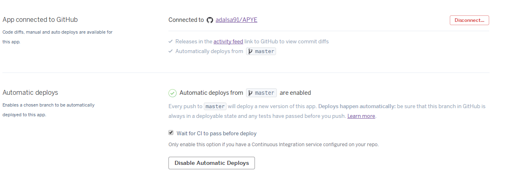

##Hito 3
En primer lugar instalamos [**Heroku CLI**](https://devcenter.heroku.com/articles/getting-started-with-python#set-up) con el siguiente comando:

```bash
$ wget -O- https://toolbelt.heroku.com/install-ubuntu.sh | sh
```

Una vez instalado iniciamos sesión.



Ahora creamos la aplicación, en mi caso he creado una para producción y otra para pruebas.

```bash
$ heroku create apye-pro
$ heroku create apye-stage
```

Y los añadimos a los remotos.

```bash
$ git remote add pro git@heroku.com:apye-pro.git
$ git remote add stage git@heroku.com:apye-stage.git
```

Creamos un fichero Procfile en la raíz de la aplciación para declarar que comandos deben ser ejecutados al iniciar la aplicación.
```
web: gunicorn app:app

```

También tenemos que especificar la versión de Python que necesita nuestra aplicación, para ello creamos el fichero `runtime.txt` con el siguiente contenido.
```
python-3.4.2
```

El resto de dependencias de la aplicación están en el fichero `requeriments.txt` en la raíz del proyecto y Heroku lo detectará automáticamente.

Debemos definir las variables de entorno, para ello usaremos las herramientas de la CLI.
```bash
$ heroku config:set APP_SETTINGS=config.ProductionConfig --remote pro
$ heroku config:set SECRET_KEY=SuperSecretKey --remote pro
$ heroku config:set APP_SETTINGS=config.ProductionConfig --remote stage
$ heroku config:set SECRET_KEY=SuperSecretKey --remote stage
```

Ya podemos hacer un push a heroku.


Ahora podemos iniciar la aplicación en local con `heroku local`.



```bash
    heroku local web
```

Antes de poder lanzar la aplicación en remoto tendremos que configurar *PostgreSQL* en *Heroku*, para ello añadimos un addon tanto al servidor de stage como al pro.

```bash
$ heroku addons:create heroku-postgresql:hobby-dev --app apye-stage
$ heroku addons:create heroku-postgresql:hobby-dev --app apye-pro
```

Con el comando `config` del CLI de *Heroku* podemos comprobar que efectivamente se ha creado la base de datos y la correspondiente variable de entorno.



Actualizamos la base de datos con las migraciones.

```bash
$ heroku run python manage.py db upgrade --app apye-pro
$ heroku run python manage.py db upgrade --app apye-stage
```



Podemos comprobar que todo está funcionando correctamente lanzando los tests.



Por último conectamos la aplicación de Heroku con el respositorio de GitHub para activar el despliegue automático, activando la opción de comprobocación de tests para que el despliegue no se realice hasta que Travis CI ejecute los tests con éxito.


